# Objetivo
Repositório destinado ao desafio proposto da Maxxidata

# Sobre o desenvolvimento
## Backend
Para desenvolver o backend decidi utilizar o framework [NestJS](https://nestjs.com/) pois já tenho uma certa familiaridade.

- A arquitetura de pastas que utilizo na aplicação é baseada em módulos e submódulos.
  - Ex.: tenho um módulo para **Profissionais** e dentro dele há um submódulo: **Tipo de Profissional** (ou Profissões).

- A documentação da API foi feita utilizando o *Swagger*. Para acessar a documentação, basta acessar o link `http://localhost:3333/api` quando a aplicação estiver em execução.

- Rotas 
  - Profissionais

  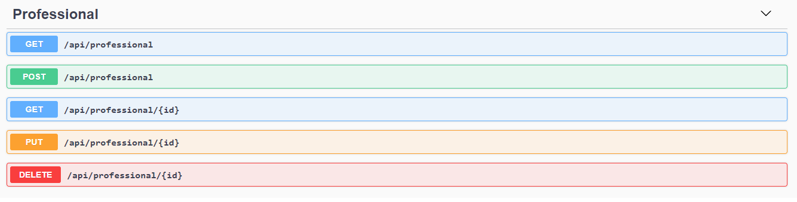
  
  - Profissões
  
  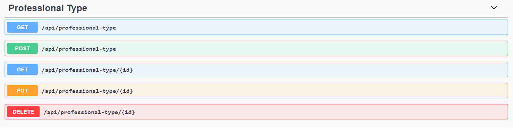

- Schemas 
  - Profissionais

  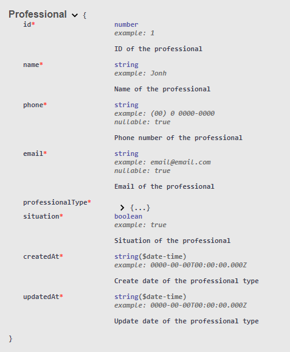
  
  - Profissões

  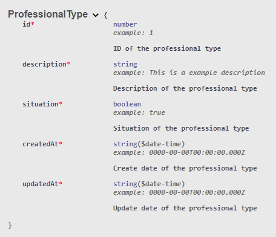

## Frontend
Para desenvolver o frontend decidi utilizar o [ReactJS](https://reactjs.org/) + [Ant Design](https://ant.design/) pois já tenho uma certa familiaridade.

- Componentes
  - Tela de Início - `Home`
  - Cabeçalho - `Header`
  - Profissionais - `Professionals`
  - Tipos de Profissional ou Profissões - `ProfessionalTypes`
  - Profissional - Profissão (Criado apenas para mostrar a relação entre os dois componentes citados acima) - `ProfessionalProfessionalTypes` 

### Telas
- Home

  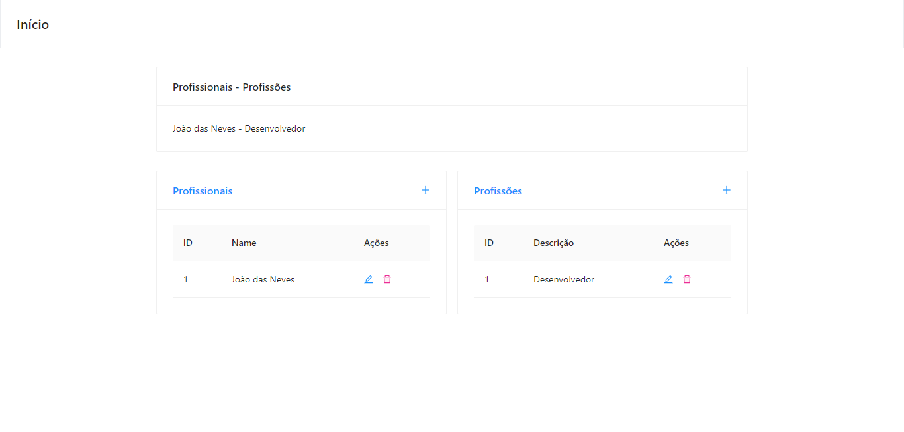

- Listar profissionais

  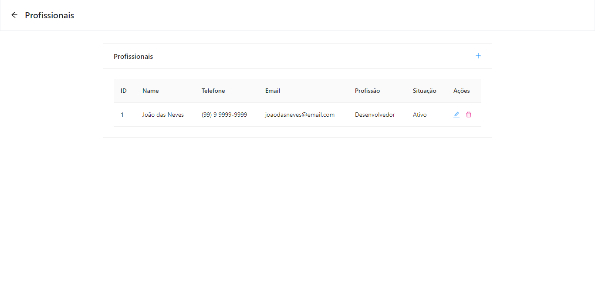

- Cadastrar profissional

  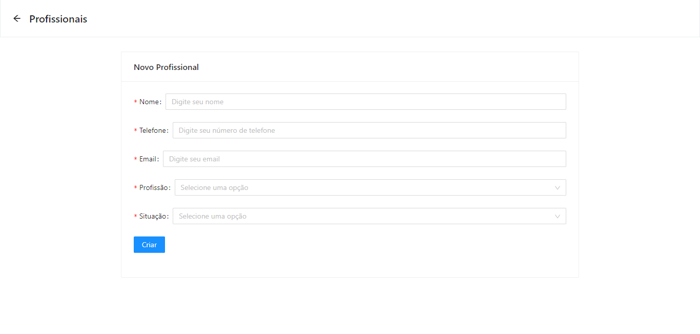

- Editar profissional

  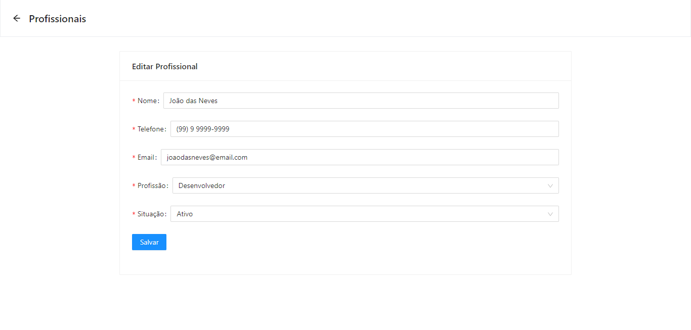

- Listar profissões

  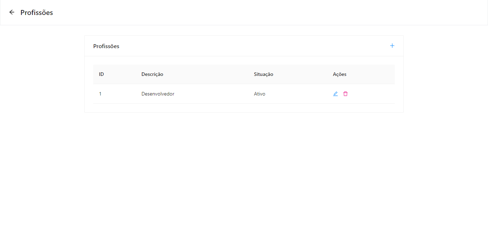

- Cadastrar profissão

  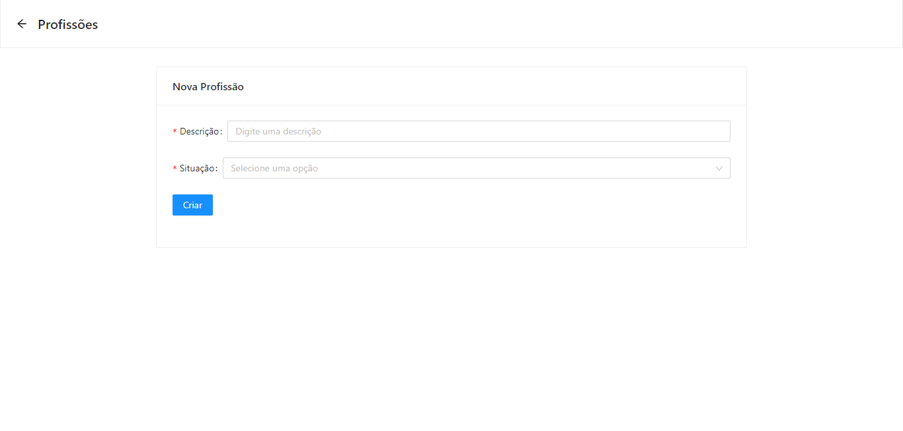

- Editar profissão

  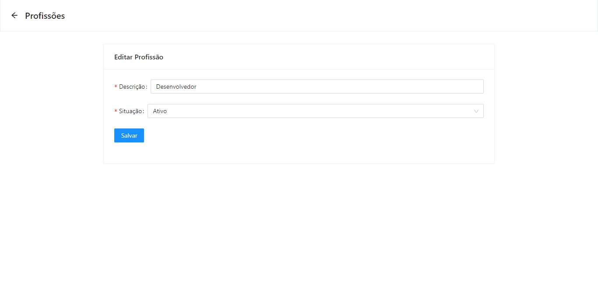
